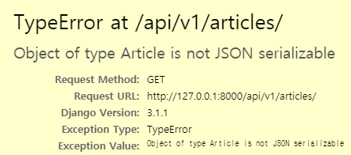

# My First DRF

django 서버를 이용해 요청에 JSON으로 응답하는 API 서버를 만들어보자

## A. JsonResponse

첫 번째 방법은 `JsonResponse` 객체를 이용하는 것이다.

- 모델

  ```python
  class Article(models.Model):
      title = models.CharField(max_length=50)
      content = models.TextField()
      created_at = models.DateTimeField(auto_now_add=True)
      updated_at = models.DateTimeField(auto_now=True)
      
      def __str__(self):
          return self.title
  ```

- 뷰

  - `JsonResponse`를 사용하기 위해서 import

    ```python
    from django.http.response import JsonResponse
    ```

  - `JsonResponse`에 인자로 넘길 `data`는 딕셔너리 타입이어야 한다.

    ```python
    def article_list(request):
        articles = Article.objects.all()
        
        data = {
            'articles': [],
        }
        
        for article in articles:
            data['articles'].append(
                {
                    'id': article.id,
                    'title': article.title,
                    'content': article.content,
                }
            )
            
        return JsonResponse(data)
    ```

  - 응답

    ```json
    {
        "articles": [
            {
                "id": 1,
                "title": "System seat physical two.",
                "content": "Indicate fine painting student purpose.\nRadio child would medical after seek. Concern need strong eight nice big.\nTechnology rock feel loss foot. Film military yourself build."
            },
            {
                "id": 2,
                "title": "Bar turn tonight media.",
                "content": "Nor sing very leave take. Report people sea ball far either hot effort. Very section itself hand billion us such. All couple control growth writer.\nMedia Democrat newspaper or seven."
            }
    }
    ```

  - 만일 딕셔너리가 아닌 타입으로 응답하고자 한다면 `safe=False` 옵션을 준다.

    ```python
    def article_list(request):
        articles = Article.objects.all()
        
        # 리스트 타입
        data = []
        
        for article in articles:
            data.append(
                {
                    'id': article.id,
                    'title': article.title,
                    'content': article.content,
                }
            )
            
        return JsonResponse(data, safe=False)
    ```

  - 응답

    ```json
    [
        {
            "id": 1,
            "title": "System seat physical two.",
            "content": "Indicate fine painting student purpose.\nRadio child would medical after seek. Concern need strong eight nice big.\nTechnology rock feel loss foot. Film military yourself build."
        },
        {
            "id": 2,
            "title": "Bar turn tonight media.",
            "content": "Nor sing very leave take. Report people sea ball far either hot effort. Very section itself hand billion us such. All couple control growth writer.\nMedia Democrat newspaper or seven."
        }
    ]
    ```

- 문제점

  - 필드를 일일이 적어주며 딕셔너리를 만들어야 하는 것이 불편하다.

  - 그렇다고 모델이나 QuerySet을 넣어주면 TypeError가 발생한다.

    

## B. serializers & HttpResponse

Django core serializers를 활용하면 QuerySet 정보를 Json으로 직렬화 할 수 있다.

- serializers를 import

  ```python
  from django.core import serializers
  ```

- QuerySet을 직렬화

  `serialize(type, QuerySet)`

  ```python
  articles = Article.objects.all()
  data = serializers.serialize('json', articles)
  ```

  이렇게하면 QuerySet이 JSON 형식의 문자열로 변환된다. `type(data)` 를 찍어보면 `<class 'str'>`로 나온다.

  이를 `JsonResponse(data, safe=False)`로 응답하면 원하는 대로 나오지 않는다. 왜냐하면 data가 그냥 하나의 문자열이기 때문에 데이터의 집합으로 보지 않고 그냥 하나의 데이터 아이템으로 보기 때문이다.

  ```
  "[{\"model\": \"articles.article\", \"pk\": 1, \"fields\": {\"title\": \"System seat physical two.\", \"content\": \"Indicate fine painting student purpose.\\nRadio child would medical after seek. Concern need strong eight nice big.\\nTechnology rock feel loss foot. Film military yourself build.\", \"created_at\": \"2004-01-29T12:45:01Z\", \"updated_at\": \"1980-11-24T10:34:53Z\"}}, {\"model\": \"articles.article\", \"pk\": 2, \"fields\": {\"title\": \"Bar turn tonight media.\", \"content\": \"Nor sing very leave take. Report people sea ball far either hot effort...."
  ```

- `HttpResponse`는 `content_type `키워드 인자를 통해 다양한 타입으로 응답할 수 있다. 기본값은 `text/html`이다.

  ```python
  from django.http.response import JsonResponse, HttpResponse
  ```

  ```python
  return HttpResponse(data, content_type='application/json')
  ```

  ```json
  [
      {
          "model": "articles.article",
          "pk": 1,
          "fields": {
              "title": "System seat physical two.",
              "content": "Indicate fine painting student purpose.\nRadio child would medical after seek. Concern need strong eight nice big.\nTechnology rock feel loss foot. Film military yourself build.",
              "created_at": "2004-01-29T12:45:01Z",
              "updated_at": "1980-11-24T10:34:53Z"
          }
      },
      {
          "model": "articles.article",
          "pk": 2,
          "fields": {
              "title": "Bar turn tonight media.",
              "content": "Nor sing very leave take. Report people sea ball far either hot effort. Very section itself hand billion us such. All couple control growth writer.\nMedia Democrat newspaper or seven.",
              "created_at": "2009-12-07T21:59:31Z",
              "updated_at": "2002-01-21T14:44:39Z"
          }
      }
  ]
  ```

- 문제점

  - serializers가 알아서 직렬화를 해주어서 편리하긴 하지만 직렬화할 데이터를 선택할 수 없다는 것이 불편하다. 예를 들어, title과 content 필드만 직렬화하고 싶은데 선택할 수가 없다. 무조건 모든 데이터가 직렬화 된다.


